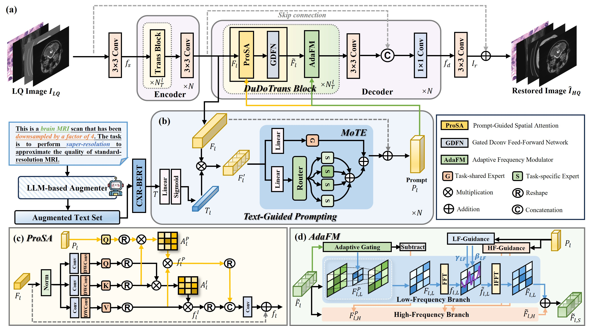
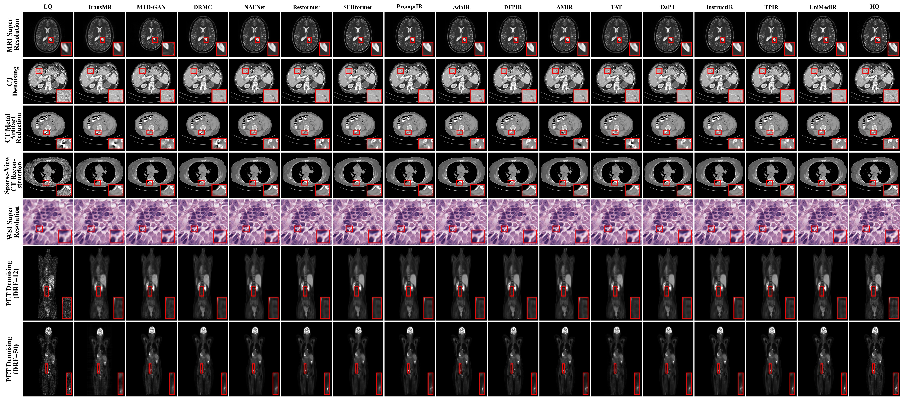

# All-In-One Medical Image Restoration via Text-Guided Prompting and Dual-Domain Modeling (UniMedIR)

PyTorch implementation for "All-In-One Medical Image Restoration via Text-Guided Prompting and Dual-Domain Modeling", Information Fusion 2026. [[paper]](https://www.sciencedirect.com/science/article/abs/pii/S1566253526004367)

## Network Architecture



## Visualization

You can use [SimpleITK](https://simpleitk.org/) or visualize the ".nii" file. 



## Acknowledgements
This code and datasets are built on [AMIR](https://github.com/Yaziwel/All-In-One-Medical-Image-Restoration-via-Task-Adaptive-Routing). Huge thanks to the authors for sharing their awesome codes!

## Citation

If you find UniMedIR useful in your research, please consider citing:

```bibtex
@article{cui2026all,
  title={All-In-One Medical Image Restoration via Text-Guided Prompting and Dual-Domain Modeling},
  author={Cui, Jiaqi and Liu, Bo and Wu, Xi and Zhou, Jiliu and Zhou, Luping and Shen, Dinggang and Wang, Yan},
  journal={Information Fusion},
  pages={104558},
  year={2026},
  publisher={Elsevier}
}
```
✉ If you have any question, feel free to email [Jiaqi Cui](mailto:jiaqicui2001@gmail.com).

